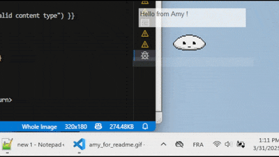

# aiAmy

A little desktop AI pet that lives on the desktop. Still very WIP, no release yet!




## Install for devs
Requirements :
- Python 3.11.9 (or above?)
- Download moondream2-text-model-f16.gguf and moondream2-mmproj-f16.gguf from https://huggingface.co/moondream/moondream2-gguf/tree/main (put it in ai_amy/ai_models directory)

Commands :
```
#Create a virtual env (=copy of your python install so the libs get installed only inside this ".venv" folder and not everywhere in the system).
python -m venv .venv

#Activate the venv.
.venv/Scripts/activate

#Install llama-cpp lib in binary format.
pip install llama-cpp-python --extra-index-url https://abetlen.github.io/llama-cpp-python/whl/cpu

#Read the pypriject.toml and install the libs.
pip install -e .[dev]

#Launch the program.
python aiAmy/main.py
```